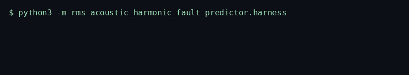
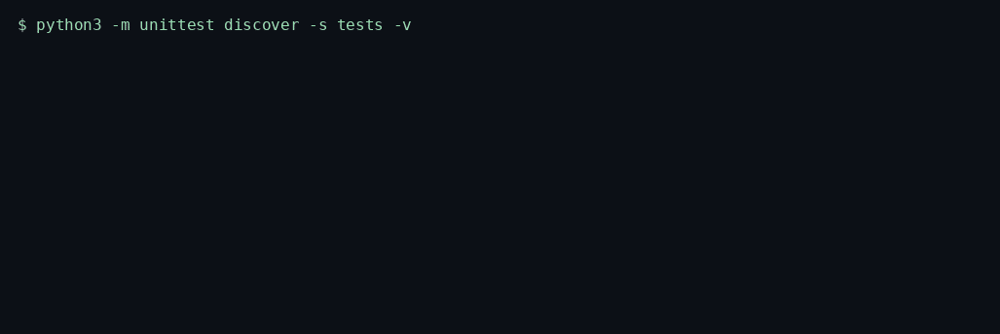

# RMS Acoustic Harmonic Fault Predictor

> Scores a vibration window with RMS, crest factor, excess kurtosis, and Goertzel magnitudes at the fundamental, second, and third harmonics.

<p>
  <a href="https://github.com/TechieGoku2623/rms-acoustic-harmonic-fault-predictor/actions/workflows/ci.yml"></a>
  
  
</p>

| | |
| --- | --- |
| **Website** | https://github.com/TechieGoku2623/rms-acoustic-harmonic-fault-predictor |
| **Topics** | `python` `asyncio` `manufacturing` `predictive-maintenance` `signal-processing` `vibration` |

## Walkthrough

Three recordings from this repository. Each one is the command in the frame, not a drawing.

### Engine

`python3 -m rms_acoustic_harmonic_fault_predictor`


Silence raises. Samples at full scale are clamped and counted. A missing sequence id skips the window.

### Benchmark

`python3 -m rms_acoustic_harmonic_fault_predictor.harness`



5000 iterations after 20 warmup, seed 10816. The frame ends on the status line and `echo $?`.

### Tests

`python3 -m unittest discover -s tests -v`



Wire round-trip, the happy path, and both edge cases below.

## Pipeline

```
window
  |
  v
RMS = sqrt(mean(x^2))
  |
  v
crest = peak / RMS
kurtosis = fourth moment / spread^4 - 3
  |
  v
Goertzel at 1x, 2x, 3x
  |
  v
fault if (mag2 + mag3) / mag1 is high
  |
  v
{rms, crest, kurtosis, harmonic_ratio, fault}
```

## Quick start

```bash
python3 -m venv venv
source venv/bin/activate
pip install -e ".[dev]"
python -m rms_acoustic_harmonic_fault_predictor
python -m rms_acoustic_harmonic_fault_predictor.harness
python -m unittest discover -s tests -v
```

Python 3.12. The runtime is the standard library. `black` and `flake8` are the `dev` extra.

## Use it

```python
import asyncio
import math

from rms_acoustic_harmonic_fault_predictor import RmsAcousticHarmonicFaultPredictor


async def demo() -> None:
    engine = RmsAcousticHarmonicFaultPredictor(
        sample_rate=1600.0, fundamental_hz=50.0, full_scale=1.0
    )
    samples = [
        0.4 * math.sin(2.0 * math.pi * 50.0 * index / 1600.0)
        for index in range(128)
    ]
    await engine.run([{"sequence_id": 0, "samples": samples}])


asyncio.run(demo())
```

## Bounds

| | |
| --- | ---: |
| Iterations | 5000 |
| Average | 1208.272 µs |
| P99 | 2146.257 µs |
| tracemalloc peak | 177768 bytes |

Figures are from the harness on the machine that published them. A later host moves the microseconds. The pass/fail result does not.

## What it refuses

- Near-zero RMS raises `EngineKernelException`. The transform does not run on silence.
- Samples at the full-scale limit are clamped and counted as clips. A sequence gap is a dropout, not a fabricated sample.

Monitoring discipline in the style of ISO 10816. This build is not an ISO certification.

## Tree

```
src/rms_acoustic_harmonic_fault_predictor/
  engine.py       kernel
  wire.py         struct frames
  harness.py      benchmark
  __main__.py     demo entry
tests/test_engine.py
Dockerfile        non-root, uid 10001
```
