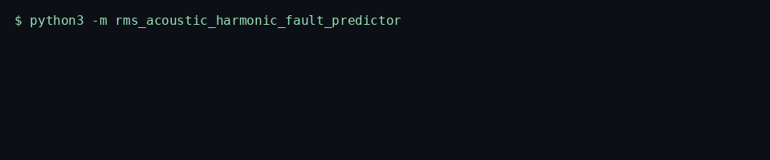

# RMS Acoustic Harmonic Fault Predictor

A high-throughput, low-latency asynchronous engine engineered to resolve bearing-style harmonic faults in a numeric acoustic window by scoring RMS, crest factor, excess kurtosis, and a Goertzel ratio of the second and third harmonics against a configured fundamental.

Website: https://github.com/TechieGoku2623/rms-acoustic-harmonic-fault-predictor

Topics: `python` `asyncio` `manufacturing` `predictive-maintenance` `signal-processing` `vibration`


## 🏗️ Systems Architecture & Event Topology

`RmsAcousticHarmonicFaultPredictor.run` accepts the windows that actually arrived. Each record is a mapping with `sequence_id` and `samples`. An `asyncio.Lock` serializes the batch. Ingress validates the cursor, then each present window is clamped, scored, and reduced to one report.

The scalar features describe the highest sequence id in the batch. `clips` and `dropouts` accumulate across that batch. A hole in `sequence_id` increments `dropouts` and does not synthesize samples. A window whose RMS is below `silence_rms` (default `1e-4`) raises `EngineKernelException` and publishes nothing. Samples at or beyond `full_scale` increment `clips` and are clamped to `+/- full_scale` before the transform.

`goertzel_magnitude` evaluates one bin. The coefficient is `2 cos(2 π f / fs)`, computed with `math.cos`. `math.sin` turns the recurrence state into a cartesian magnitude. The engine calls it at the configured fundamental and at harmonics 2 and 3. `harmonic_ratio` is `(mag2 + mag3) / mag1`. `fault` is true when that ratio exceeds `ratio_limit` (default 0.25).

The header is `struct` format `>dII`: float64 sample rate, uint32 length, uint32 flags. Bit 0 is the fault bit, bit 1 means the batch clamped at least one sample, and bit 2 means at least one sequence id was missing. `wire.pack_header` and `wire.unpack_header` are the roundtrip. The process keeps a bounded in-memory spool of those headers. It does not open a socket.

ISO 10816 is the commentary reference for broadband RMS severity bands. This module does not assign a machine zone and does not certify a balance grade.

## 📊 Core Visual Walkthrough & Engine Pipeline Flow



```
sequence_id, samples[]
        |
        v
 numeric gate ---- non-finite / short window --> EngineKernelException
        |
        v
 sort by sequence_id
        |
        +-- gap between ids -------- dropouts += missing count
        |                           (those windows are not invented)
        v
 |sample| >= full_scale --> clips += 1, clamp to +/- full_scale
        |
        v
 RMS = sqrt(mean(sample^2)) ---- rms < silence --> EngineKernelException
        |
        +--> crest = peak / RMS
        +--> excess kurtosis = m4 / sigma^4 - 3
        v
 Goertzel coefficient = 2*cos(2*pi*f/fs) at f, 2f, 3f
        |
        v
 harmonic_ratio = (mag2 + mag3) / mag1
        |
        +-- ratio > limit --> fault
        v
 struct header: sample_rate, n, flags
```

Insert the structural terminal walkthrough recording at docs/assets/terminal-walkthrough.gif before publishing the release notes.

## ⚡ Low-Level OS Mechanics & Network Physics

The score runs on the calling event loop. `run` holds one `asyncio.Lock`, yields once in ingress and once before the header is appended to a `deque`, and does not spawn a process or a thread. There is no device file, no waveform socket, and no broker client. The only bytes that leave the scorer are the 16-byte header in the in-process spool.

RMS is `sqrt(statistics.fmean(sample^2))` on the clamped window, so a DC offset is energy, not a hidden fault. Crest factor divides the clamped peak by that RMS. Excess kurtosis uses `statistics.fmean` of the fourth central moment and `statistics.pstdev` (population) in the denominator, then subtracts 3. A near-zero spread returns kurtosis 0 instead of dividing by zero; a near-zero RMS never reaches that branch because it has already raised.

Goertzel keeps two state variables per bin and one coefficient. Magnitude is scaled by `2 / N`, so a pure sine of amplitude `A` reads back near `A`. The ratio cancels that scale. The third harmonic must sit strictly below Nyquist or the constructor raises. Window length is bounded to 16..8192 samples so a single call cannot pin the loop on an unbounded buffer.

## ⚖️ Architecture Trade-offs & Pragmatic Decisions

A production vibration monitor would run a long FFT, an envelope spectrum, and a bearing-frequency catalog. Those need a known shaft rate and a known geometry. This engine flags the condition that catalog search starts from: the second and third harmonics, at a caller-supplied fundamental, dominate that fundamental inside one finite window. The score is a ratio, so a louder machine does not look healthier by itself.

Clipping is counted and the sample is clamped before Goertzel, crest, kurtosis, and RMS. A rail-saturated sample manufactures harmonics; the clip count is how a caller refuses to treat that window as a clean bearing call. The ratio is still reported. Dropout does not zero-fill. The missing ids are a count, and the scalar features stay those of the highest id that actually arrived.

The fundamental is configured, not searched. Searching a band of bins would retune itself onto a harmonic and hide the fault the ratio is meant to see.

## 🚀 Local Installation & Benchmarking

```bash
python3 -m venv venv
source venv/bin/activate
pip install -e ".[dev]"
python -m rms_acoustic_harmonic_fault_predictor
python -m rms_acoustic_harmonic_fault_predictor.harness
```

```python
import asyncio
import math

from rms_acoustic_harmonic_fault_predictor import RmsAcousticHarmonicFaultPredictor


async def demo() -> None:
    engine = RmsAcousticHarmonicFaultPredictor(
        sample_rate=1600.0, fundamental_hz=50.0, full_scale=1.0
    )
    samples = [
        0.4 * math.sin(2.0 * math.pi * 50.0 * index / 1600.0)
        for index in range(128)
    ]
    await engine.run([{"sequence_id": 0, "samples": samples}])


asyncio.run(demo())
```

The runtime is the Python 3.12 standard library. `pip install -r requirements.txt` succeeds with no third-party pins. `black==24.8.0` and `flake8==7.1.1` live in the `dev` extra.

## 🖥️ Terminal Diagnostic Output Preview

```
2026-10-02T02:58:18+0000 INFO [rms_acoustic_harmonic_fault_predictor] fault window ratio=0.6500 rms_bins=0.400000 0.160000 0.100000
2026-10-02T02:58:18+0000 INFO [rms_acoustic_harmonic_fault_predictor] demo complete fault=True harmonic_ratio=0.6500 rms=0.312730 clips=0 dropouts=0
```

`python -m rms_acoustic_harmonic_fault_predictor` exits 0. The demo window is `0.40 sin(f) + 0.16 sin(2f) + 0.10 sin(3f)` at 50 Hz and 1600 samples/s. The three Goertzel magnitudes match those amplitudes, and the ratio is 0.65.

## 📊 Empirical Benchmarking Performance Report

Measured by `python -m rms_acoustic_harmonic_fault_predictor.harness` with seed 10816, 5000 iterations after a warmup of 20, `time.perf_counter_ns` latency in microseconds, and `tracemalloc` peak. The window is a fundamental tone plus a seeded micro-noise, which scores with `fault` false.

```
status=ok seed=10816 iterations=5000 latency_us=1177.358 memory_peak_bytes=177768 benchmark_avg_us=1208.272 benchmark_p99_us=2146.257
```

| Metric | Measured |
| --- | ---: |
| Status | ok |
| Seed | 10816 |
| Iterations | 5000 |
| latency_us | 1177.358 |
| memory_peak_bytes | 177768 |
| benchmark_avg_us | 1208.272 |
| benchmark_p99_us | 2146.257 |

## 🛡️ Edge-Case Resilience & SOC2/Regulatory Compliance

A near-zero RMS raises `EngineKernelException` with a silence message and does not return a scored dict. A non-finite sample raises the same exception. Samples at or beyond full scale increment `clips` and are clamped before the transform, so a single rail spike does not dominate RMS. A gap in `sequence_id` increments `dropouts` by the number of missing ids and does not invent the missing windows. The reported RMS, crest, kurtosis, harmonic ratio, and fault bit belong to the highest id that was actually supplied.

ISO 10816 is commentary for how RMS is discussed in vibration monitoring. This package does not certify a machine, does not assign a zone, and does not describe how to defeat an interlock or a trip. SOC 2 processing integrity is the batch rule: a rejected silence window is absent from the report, and a dropout is an explicit count rather than a silent hole filled with fabricated samples.
